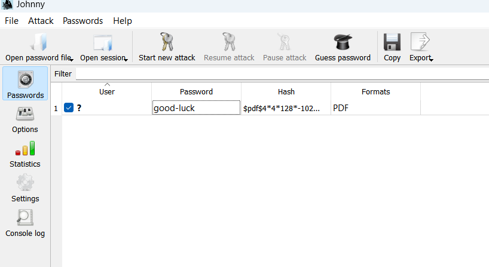
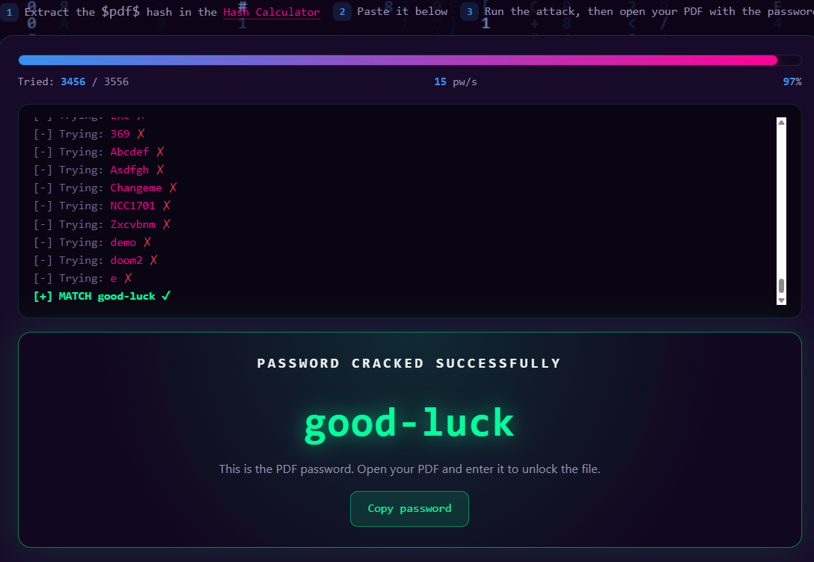
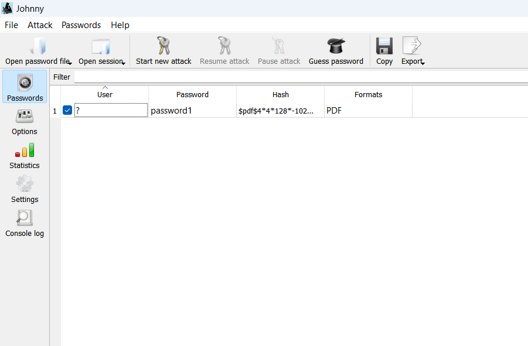
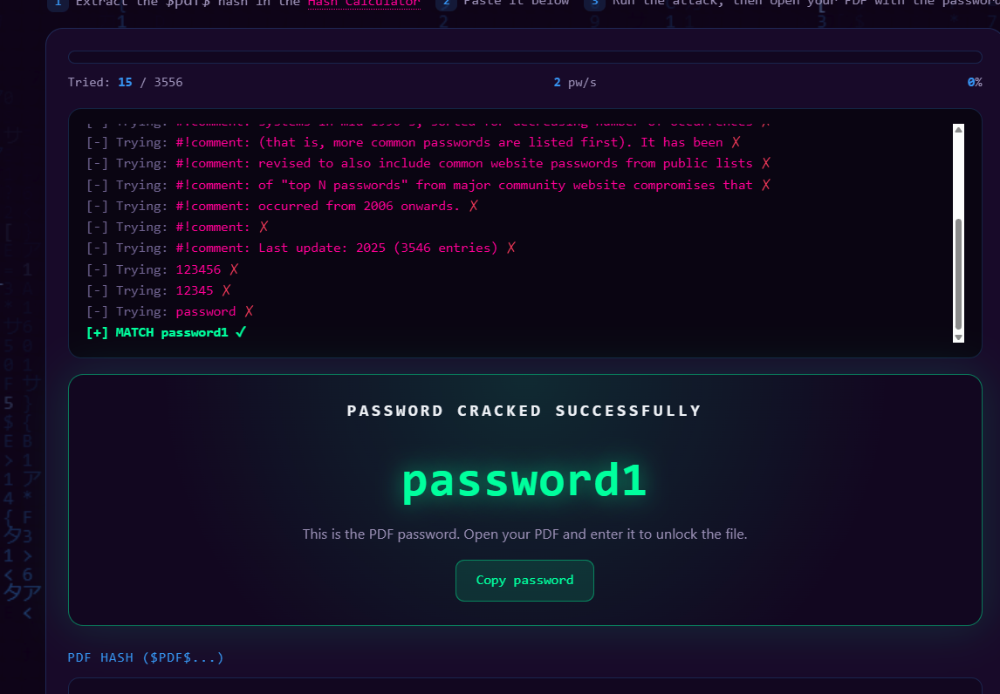
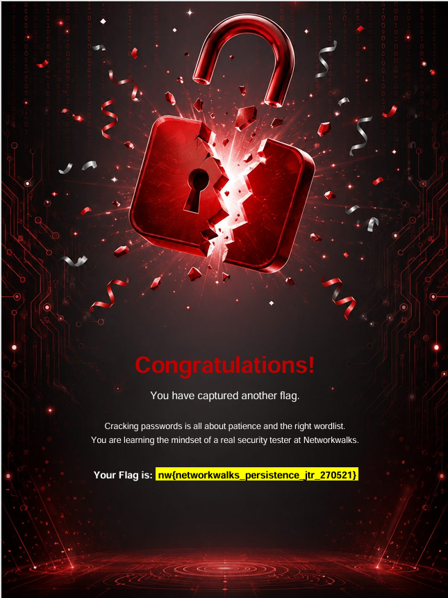
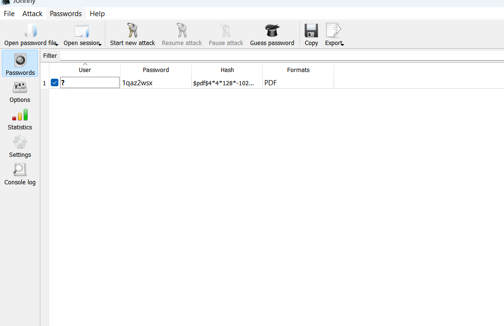
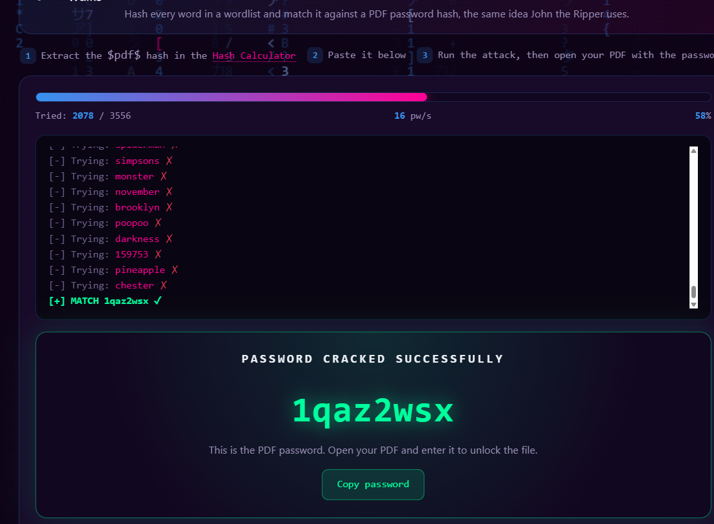
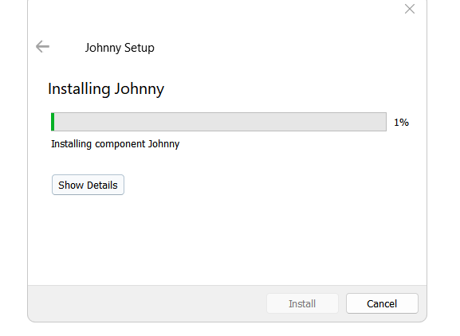

[README (2).md](https://github.com/user-attachments/files/32580392/README.2.md)
# OFFLINE_PDF_HASH_CRACKING_ANALYSIS
Cybersecurity lab report on offline PDF hash cracking and dictionary attacks
# Offline PDF Hash Cracking Analysis

> **Incident & Vulnerability Lab — Cybersecurity Training Report**

This project documents a controlled cybersecurity lab focused on recovering passwords from protected PDF files by extracting PDF hashes and performing dictionary attacks. The exercise compares a local **John the Ripper (JTR) / Johnny** workflow with the **Networkwalks** web-based tools.

## Lab Information

| Field | Details |
|---|---|
| **Author** | Ibrahim Usman Maiwake |
| **Role** | Cybersecurity Intern |
| **Program / Batch** | Networkwalks Internship / B083C |
| **Instructor** | Waqas Karim CCIE |
| **Date** | September 23, 2026 |
| **Classification** | Internal / Training |

## Objectives

- Demonstrate the process of recovering passwords from protected PDF files by extracting their hashes and using dictionary attacks.
- Compare the methodology of a local John the Ripper (JTR) installation with the web-based Networkwalks tools.

## Environment & Tools

| Category | Tools / Details |
|---|---|
| **Operating System** | Windows |
| **Hash Extraction** | Online Hash Extractor (`onlinehashcrack.com`), Networkwalks Hash Calculator |
| **Password Cracking** | John the Ripper (JTR) / Johnny GUI, Networkwalks Password Cracker |

## Methodology

### Module 1 — John the Ripper (JTR)

1. **Hash Extraction:** The online tool at `onlinehashcrack.com` was used to extract the `$pdf$` hashes from the locked PDF files.
2. **Preparation:** The extracted hash values were saved into `.txt` files for local processing.
3. **Cracking Process:** The hash files were imported into the Johnny GUI, which provides a graphical interface for JTR, and a dictionary attack was executed to recover the passwords.

### Module 2 — Networkwalks Tools

1. **Hash Extraction:** The target PDF files were uploaded to the Networkwalks Hash Calculator to parse the files and extract their hashes within the web browser.
2. **Cracking Process:** The extracted hashes were supplied to the Networkwalks Password Cracker, where its built-in wordlist attack was executed to recover the passwords.

## Results

The dictionary attacks recovered the passwords for all three target PDF files and enabled the associated flags to be captured.

| Target | Recovered Password | Captured Flag | Methods Used |
|---|---|---|---|
| **1** | `good-luck` | `nw{cybersecurity_flag_captured_2608}` | JTR / Johnny; Networkwalks Password Cracker |
| **2** | `password1` | `nw{networkwalks_persistence_jtr_270521}` | JTR / Johnny; Networkwalks Password Cracker |
| **3** | `1qaz2wsx` | `nw{networkwalks_flag_260821_1}` | JTR / Johnny; Networkwalks Password Cracker |

### Target 1

- **Extracted Hash:** `$pdf$4*4*128*-1028*1*16*ca7f72f...`
- **Cracked Password:** `good-luck`
- **Captured Flag:** `nw{cybersecurity_flag_captured_2608}`

#### Evidence

**Johnny result**

**Networkwalks password-cracker result**

**Captured flag**

### Target 2

- **Extracted Hash:** `$pdf$4*4*128*-1028*1*16*0853f2c...`
- **Cracked Password:** `password1`
- **Captured Flag:** `nw{networkwalks_persistence_jtr_270521}`

#### Evidence

**Johnny result**

**Networkwalks password-cracker result**

**Captured flag**

### Target 3

- **Extracted Hash:** `$pdf$4*4*128*-1028*1*16*34eb542...`
- **Cracked Password:** `1qaz2wsx`
- **Captured Flag:** `nw{networkwalks_flag_260821_1}`

#### Evidence

**Johnny result**

**Networkwalks password-cracker result**

**Captured flag**

## Johnny Installation

The lab also documented the installation of Johnny, the graphical interface used for the local JTR workflow.

## Mitigation & Remediation Strategies

To reduce the likelihood of successful offline dictionary attacks, the following controls and policies should be implemented:

### 1. Enforce Strong Passphrases

Dictionary attacks rely heavily on common words and simple alphanumeric sequences. Long passphrases with high entropy make dictionary and brute-force attacks substantially more difficult.

### 2. Avoid Predictable Patterns

Users should avoid standard keyboard walks such as `1qaz2wsx` or appending numbers to common words such as `password1`, because modern wordlists commonly test these patterns.

### 3. Use Strong Encryption Standards

Files should be secured using robust encryption algorithms such as AES-256 rather than legacy encryption methods, increasing the effort required for cracking attempts.

### 4. Consider Certificate-Based Security

For highly sensitive documents, certificate-based encryption can reduce reliance on human-selected passwords.

## Conclusion

The exercises demonstrated that predictable passwords such as `password1` and `1qaz2wsx` can be recovered using standard wordlists and readily available tools. The results reinforce the importance of strong password selection, avoidance of predictable patterns, and appropriate document-encryption controls when protecting files against offline hash-cracking attempts.

## Ethics & Scope

This report documents a controlled training exercise performed against designated lab files. Password-recovery and hash-cracking techniques should only be applied to systems, files, and accounts for which you have explicit authorization.

---

**Project:** Offline PDF Hash Cracking Analysis  
**Training:** Networkwalks Internship / B083C  
**Author:** Ibrahim Usman Maiwake
